<table>
<tr>

<td width="35%" align="center">

</td>

<td width="65%">

# Arnav Gupta

### CSE @ VIT Vellore

**Full-Stack Developer · AI/ML Explorer**

Building with **React, Next.js & Node.js**  
Exploring **AI/ML · DSA · Full-Stack Development**

 

### 🌐 Connect

</td>

</tr>
</table>

---

# 💫 About Me

Third-year CSE @ VIT Vellore | Full-Stack Developer | Building with React, Next.js & Node.js | Exploring AI/ML

---

# 💻 Tech Stack

### Languages

### Frontend

### Backend

### Databases

### Data & AI/ML

### Tools & Technologies

---

# 📊 GitHub Activity

---

**Building → Learning → Improving**

